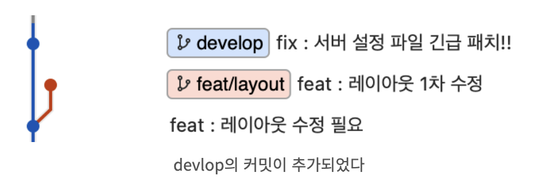
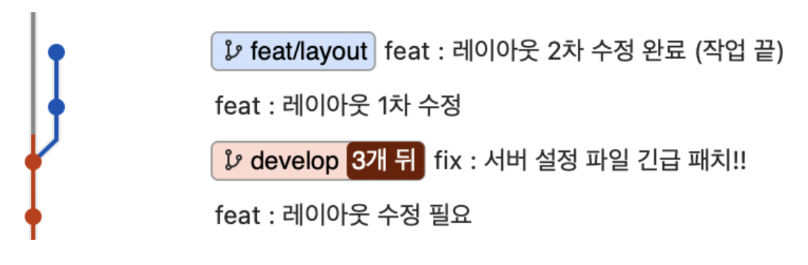
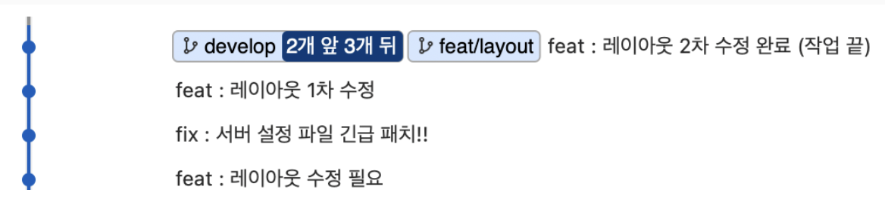
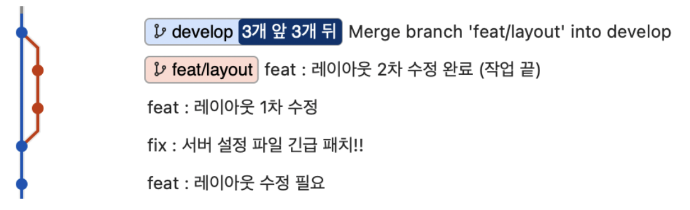

# Rebase

```Merge```는 단순히 브랜치를 병합할 때 사용된다. 병합을 하고 나서 그 전에 작업했던 브랜치에 대한 히스토리 또한 모두 남게 된다.

```Rebase```의 경우 단어 그대로 base 브랜치를 새로 설정하는 것이다.

그렇다면 ```Rebase```는 언제 어떻게 사용되는 걸까?

### feature 브랜치 작업 중 base 브랜치가 수정되는 경우

feature 브랜치를 생성하고 해당 브랜치에서 작업을 진행하고 있는 와중 base 브랜치인 develop 브랜치에 긴급 커밋이 일이 생겼다고 해보자. 

그리고 이 긴급 커밋 내용이 설정파일 오류 수정이라 feature 브랜치에도 커밋이 반영되어야 하는 상황이다.

</img>

이러한 상황을 **non fast-forward** 상황이라고 한다.

이때 ```Rebase```를 사용하여 병합할 경우 다음과 같이 된다.

1. feature 브랜치를 develop 브랜치로 rebase 해준다.

    ```bash
    git rebase develop
    ```
    </img>

2. 작업을 이어나간다.

    </img>

3. 작업이 끝나면 feature 브랜치를 develop 브랜치로 merge한다.

    ```bash
    git merge feat/layout
    ```
    </img>

    이때 git merge는 default값이 fast-forward이므로 히스토리 관리를 하기 위해 non fast-fowward 옵션으로 merge하면 다음과 같이 된다.

    ```bash
    git merge --no-ff feat/layout
    ```
    </img>

## 출처

- [[GIT 좀 더 이해하기] 3. merge 와 rebase 차이](https://kghworks.tistory.com/133)
- [SourceTree에서 Rebase+Merge로 깔끔한 브랜치라인 유지하기](https://wbluke.tistory.com/26)