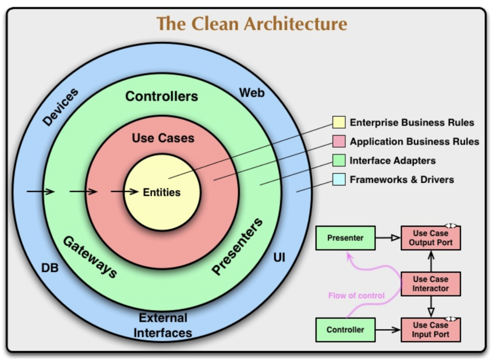
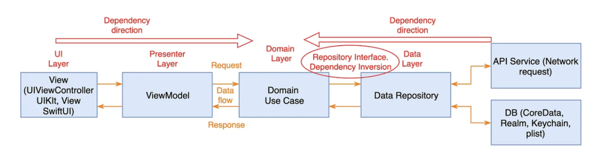

# Clean Architecture

- Dependency Rule에 근거하여 UncleBob이 제안한 System Architecture

- Clena Architecture에서 가장 중요한 룰은 **내부 레이어는 외부 레이어를 절대로 알아선 안된다** 이다. 이 룰이 바로 **Dependency Rule** 이다.

- **Dependency Rule**을 따름으로써 system은 파일간 관심사가 분리됨으로 의존성이 떨어지고, 결과적으로 테스트하기 쉬운 system이 만들어진다.

[Clean Architecture의 다이어그램]

</img>

## Clean Architecture + MVVM

### Presentation Layer

화면을 나타내는 layer로 UI나 View와 관련된 layer이다.

- View : 화면에 보여지는 UI와 관련된 코드 파일 ( = ViewController)

- ViewModel : UI와 관련된 코드(ex. UIKit)는 없어야하며, Use Case를 호출하여 비즈니스 로직을 수행하는 계층이다.

### Domain Layer

> **Domain Layer에서는 다른 layer를 절대절대 참조해서는 안된다.**

- Entity : Business Model 그 자체이다. 보통 Codable을 채택하고 있는 객체를 말한다. 가장 안쪽에 위치한 Layer로 외부 Layer와 단절된 Layer이다.

- UseCase : Business Logic이다. 사용자의 시나리오에 맞게 Entity의 데이터 흐름을 조정한다. 

- Repository Interface : 주로 protocol로 이루어져 있으며 Data layer과 Domain Layer 사이의 의존성 역전 현상을 막기 위해 만들어졌다. 
    - ex) 사용자가 새로고침을 하여 fetch를 해야하는 상황

### Data Layer

- Datasource : 데이터를 가져오는 곳을 말한다. 
    - ex) API 주소, Local DB(Core Data, plist 등), 캐시

- Repository : Datasource에서 데이터를 받아오고 저장하기위한 객제이다.
    - API 연동 - Alamofire나 URLSession 등 구현
    - 로컬 DB - 해당 DB와의 상호작용을 위한 코드 구현

## 결론

Data flow

</img>

## 출처
- [[iOS] CleanArchitecture 톺아보기](https://velog.io/@yoosa3004/iOS-CleanArchitecture-%ED%86%BA%EC%95%84%EB%B3%B4%EA%B8%B0#reposiotry-interface)

- [[Clean Architecture]란 무엇인가](https://haksae.tistory.com/44)

- [ZeddiOS - Clean Architecture](https://zeddios.tistory.com/1065)

- [[GitHub] iOS-Clean-Architecture-MVVM](https://github.com/kudoleh/iOS-Clean-Architecture-MVVM)