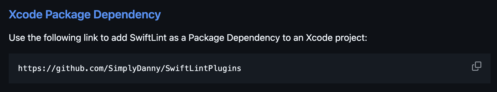
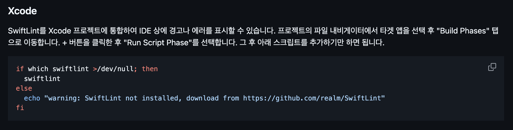
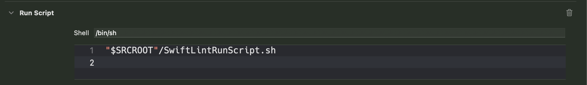

# SwiftLint 오류 해결

오늘은 프로젝트 초기 세팅을 해주고 SwiftLint를 적용하는 과정에서 많은 수행착오를 겪었다.

프로젝트 초기 세팅을 해주는 과정에서 우리 팀은 `SwiftLint`를 `SPM`을 사용하여 설치하기로 결정했다.

처음엔 SwiftLint의 리드미에 나와있는 아래 사진과 같이 `SwiftLintPlugins`를 설치해주었다.



하지만 .. Lint가 적용은 커녕 실행이 되지도 않았다..

첫 오류는 `brew`를 사용해 `SwiftLint`를 따로 설치해줬어야 했는데, 그걸 하지 않아서 난 오류였다.

그러고 나서도.. 오류가 해결되지 않았고 아래와 같은 오류가 발생했다.

> SourceKittenFramework/library_wrapper.swift:58: Fatal error: Loading sourcekitdInProc.framework/Versions/A/sourcekitdInProc failed
[1]    88632 trace trap  swiftlint

위 에러를 검색해본 결과 나와 똑같은 오류를 겪은 Issue가 [SwiftLint 레포](https://github.com/realm/SwiftLint/issues/1466)에 생성이 되어있었고, 해당 Issue의 comment를 참고하여 해당 에러를 해결할 수 있었다.

---

근데도. SwiftLint는 적용되지 않았다. 왜 ????

저 위에서 다운받은 `SwiftLintPlugins`는 구라핑이었던 것 같다. (솔직히 저거 SwiftLint 공식 레포 리드미에 나와있는건데 왜.. 안되는거였는지 아직도 이해는 안됨..)

그냥 SwiftLint만 설치했을 때에도 해당 SPM 내부에 Plugin이 들어있었는데, 이를 `Targets` -> `Build Phases` -> `Run Build Tool Plug-ins` 에 추가해주면 되는 쉬운 작업이었다.

여기까지의 작업을 통해 `SwiftLint`의 기본 룰을 적용할 수 있게 되었다.

---

이제 커스텀 룰을 만들어 적용하기 위해 lint rule이 작성된 `yml` 파일을 만들고 해당 파일을 실행시켜주는 작업이 필요했다. (여기서 정말.. 좀.. 난항을 겪었던 것 같다..)

처음엔 아래 사진과 같이 SwiftLint 레포 리드미에 나와있는대로 Script를 넣어주었다.



응 안돼 ~ 돌아가 ~ 😇 (~~이쯤되면 공식 레포는 믿고 걸러야하는게 아닌지..~~)

영규님 덕분에 위 문제를 해결할 수 있었는데, 먼저 위 Script로 `SwiftLint`가 적용되지 않았던 이유를 Script가 제대로된 `swiftlint.yml` 파일의 PATH를 찾지 못했기 때문이라고 판단했다. (PATH를 찍어보니 이상한 simulator의 경로가 찍혀있었음 ㅇㅇ)

이를 해결하기 위해, 아래 코드와 같이 `swiftlint.yml` 파일이 존재하는 경로를 하나의 script 파일로 감싸주는 script 파일을 프로젝트 내부에 생성해주었다.

```shell
if test -d "/opt/homebrew/bin/"; then
	PATH="/opt/homebrew/bin/:${PATH}"
fi

export PATH

YML="$(dirname "$0")/.swiftlint.yml"

if which swiftlint > /dev/null; then
	swiftlint --config ${YML}
else
	echo "warning: SwiftLint not installed, download from https://github.com/realm/SwiftLint"
fi
```

그리고 해당 파일을 `Run Script`에 넣어주는 방식으로 해결하였다.



> 추가로 이 과정에서 영규님께 배운 깨알 지식: Build Phases는 적혀져있는 순서대로 컴파일 시점에 실행된다는 점 !! 
>
> 신기해서 찾아봤는데, 무조건 저 순서대로 실행되는 건 아니고, 빌드 시스템이 더 잘알고 있는 경우에는 순서가 바뀌어 실행될 수도 있다고 한다. (찾아볼 때 증분빌드까지 웅엥ㅇ 나오는데,, 지금 그것까지 읽을 여력이 되지 않아.. 그냥 대강 훑어봤을때 저렇다고..했다.. 응.. 틀린 정보일 수 있으니 유의..)
>
> 출처: [갓 zeddios](https://zeddios.tistory.com/919)

---

근데 방금 지용님께서 slack에 올려주신 내용을 읽어봤는데, 우리 프로젝트는 sandbox 설정이 `No`로 되어있다.. 지용님왈.. 


혹시나해서 다시 `Yes(Default)`로 바꿔보았는데 바로 오류뜸... 

ㅠㅠ 내일 한 번 팀원들과 다시 이야기를 해봐야겠다....🫠🫠

